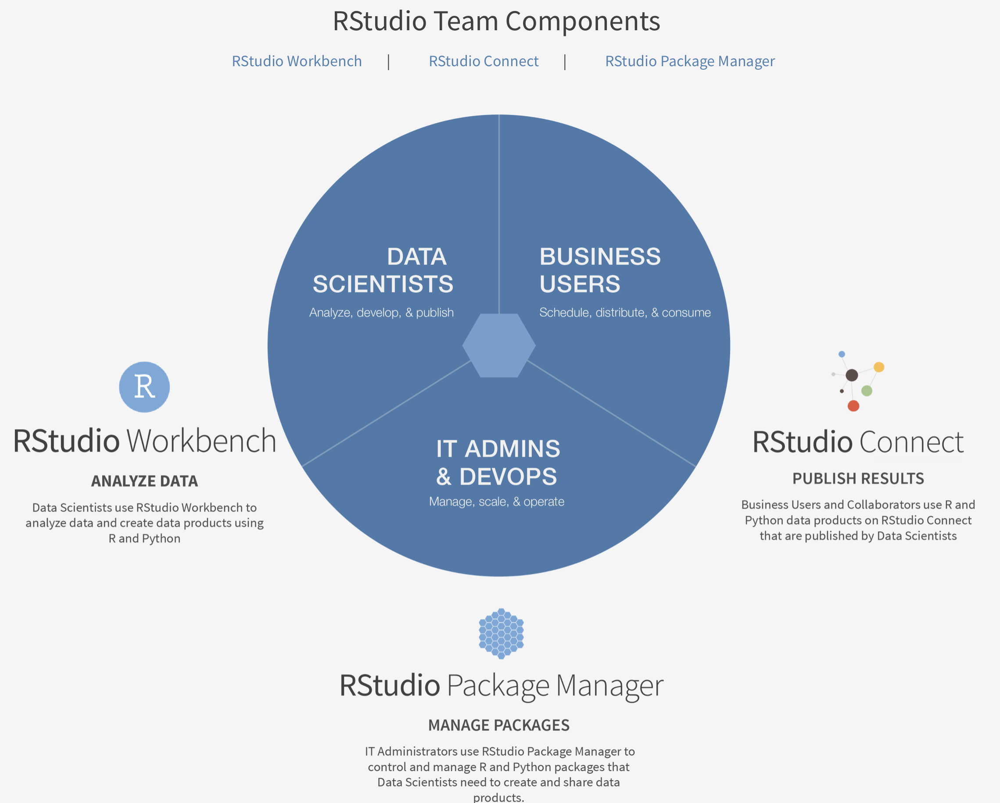
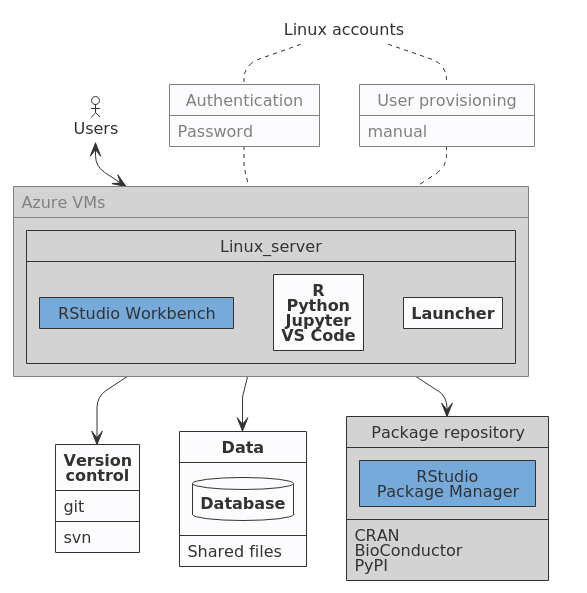
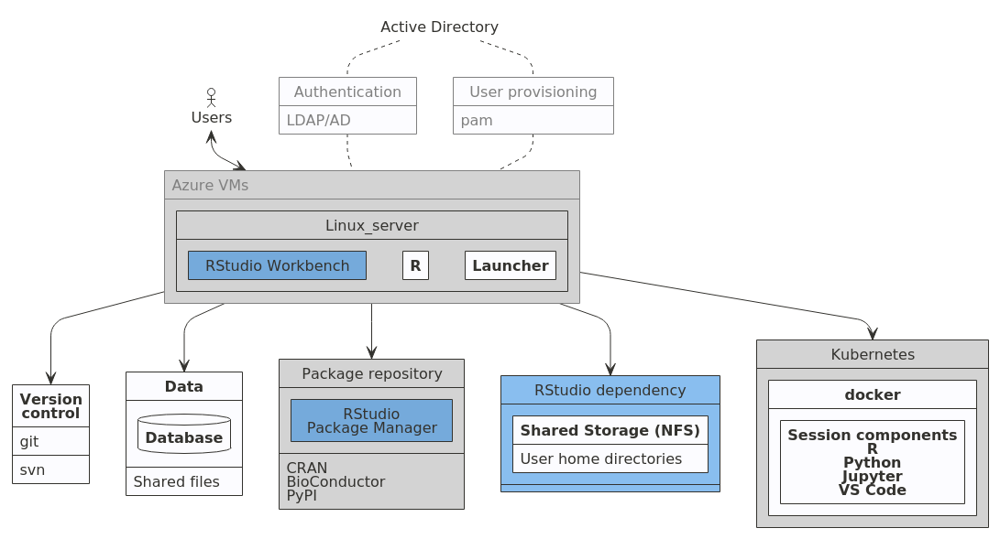

```{r setup, include=FALSE}
knitr::opts_chunk$set(echo = FALSE)
```
# Introduction

The unstoppable algorithmic transformation of financial services has seen the financial technology (FinTech) industry surge from the sidelines to the mainstream^["A progress report on fintech's record-breaking year" by Nicholas Megaw August 2021. [*gated link*](https://www.ft.com/content/89ea3d5d-cd29-46ec-88f1-67729b09a7c2?shareType=nongift)]. The UK is leading the way in this surge, where FinTech is viewed as a permanent, technology revolution, that is changing the way we do finance^[[Kalifa Review of UK FinTech 2021](https://www.gov.uk/government/publications/the-kalifa-review-of-uk-fintech)].  FinTech is multidisciplinary, and is moving from the technological era of SMAC^[social, mobile, analytics and cloud] to a future where DARQ^[distributed ledger technology, artificial intelligence, extended reality, Quantum computing] technologies are the next differentiator combination. For students to remain relevant in this fast pace world, computation needs to be a central tenant in their finance education. 

While finance is a social science, many parts of modern finance are fundamentally quantitative, with financial practitioners solving empirical problems using innovative technologies.  Furthermore, the rise of big and alternative data in combination with the exponential growth of AI and financial data science has created new opportunities in the financial sector.  The application is now widespread including areas of risk management[@Lin2017], portfolio construction[@Jaeger2021], investment banking[@IBC2020] and insurance[@SOA2020]. In short the *algorithmisation* of finance is unstoppable.

While narrow AI, which uses rule-based algorithms, has dominated the fast-paced automation of tasks and process in finance the next wave of automation will be in digitising judgement calls [@Lopez_de_Prado2018].  Given that finance professionals have an important fiduciary duty towards their clients, the rapid growth on artificial intelligence (AI) in finance has highlighted some important risks around trust, overfitting, lack of interpretability, biased inputs and unethical use of data.  Now more than ever highly computationally digitally literate finance graduates are needed to balance AI and financial machine learning with sustainability, ethics, bias, and privacy to create *trustworthy* data-driven decisions [@Mahdavi2020].

The UK is leading the way in Financial Technology (FinTech) innovation and are forging on with a large scale plan post-Brexit. The recent Kalifa Review of UK Fintech
sets out an ambitious 5 point plan to foster and scale UK based Fintech firms.  A central part of this plan is to *upskill* and *reskill* adults by developing training and course from high-quality universities. Now more than ever, there are exciting opportunities for computationally literate finance graduates in the UK.

This paper provides an overview of the opportunities and challenges for the finance education curricula in the fast-paced world of financial technology innovations.  We specifically focus on econometrics and the emerging field of financial machine learning and how to embed computation as a central tenant to allow for a frictionless approach to teaching.  We provide an overview of how this has been achieved in the Management School of Queens University Belfast using a enterprise-scale cloud computing infrastructure and a suite of enterprise-level web software.

# Background
## What is financial machine learning?
Machine learning has been adopted at pace in many real world applications, but has been slow to develop in areas of scientific research, especially financial research where traditional econometric techniques dominate.  Leading econometricians argue this is due to a clashing culture [@Athey2019a], where some financial economist view the ontological differences in econometrics and machine learning as intractable . This naive comparison highlights the epistemological challenges that are faced by computer age statistical inference in a world of rapid algorithmic development [@Efron2016]. Financial machine learning is a sub field of AI in its infancy, which is attempting to reconcile the differences between econometrics and machine learning.

Machine learning can be defined as a branch of nonparametric statistics mixing, statistical learning, computer science and optimisation [@Molina2019] where algorithms are made up of three fundamental building blocks:

1. A loss function
2. An optimisation criteria
3. A optimisation routine    

Changes in each of these building blocks produces a wide variation of learning algorithms characterising the degree of supervision. From an econometric perspective, these models are biased due to their optimisation of a restricted objective according to a specific algorithmic methodology and statistical rationale.  On the other hand, econometrics applies statistics to a data sample, usually in the form of a regression analysis, to examine relationships. Model design uses well-journeyed economic theory to develop *unobservable* hypothesised model. Asymptotic theory is then relied upon to produce objective statistical inference which minimises bias, possibly at the expensive of increased sampling variation.

Financial machine learning attempts to resolve three broad conflicts between machine learning and econometrics[@Lommers2021]:

1. The importance of statistical inference;
2. Causality;
3. A prior hypotheses and model assumptions.

### Statistical inference
Statistical inference is a broad discipline at the intersection of mathematics, empirical science and philosophy. Since its philosophical beginnings through the publication of the Bayes rule in 1763^[Which was used by early advocates to argue the existence of god] computation has been a traditional bottleneck for applied statistical inference frameworks and has motivated small sample solutions with strong asymptotic principles.  

Traditional econometrics retained much of this framework arguable because of the sparsity of data to proxy the realisation of theory.  Up until about the early 1950s computation had been a traditional bottleneck for applied statistics statistical [@Efron2016].  More recently, increases in power and accessibility of computation, has seen machine learning techniques being adopted for statistical inference^[One notable example is the *bootstrap* a computer-intensive inferential engine that is now ubiquitous in applied statistics]

Statistical inference is the bedrock of econometrics, while the main focus of machine learning is prediction. In traditional econometrics, models are built to learn statistical information and uncertainty about the parameters of the underlying data generating process, using an a prior probability model of the data generating process, with a proven track record under strict assumptions. Armed with this theoretical confidence, and using the dominant frequentist approach, econometricians can objectively infer uncertainty and variation characteristics about how well the data sample maps to the theoretical data generating process.  

There is a significant faith placed on probability theory for distributional assumptions and model specifications to be amenable to statistical inference. The three most assumed properties in most traditional econometrics models are linearity, additivity and monotonicity. It is argued that the most important assumption, which is rarely cited in textbooks, is *validity* which can be defined as: 

> The data you are analysing should map to the research question you are trying to answer.  This sound obvious but is often overlooked or ignored because it can be inconvenient.  Optimally, this means that the outcome measure should accurately reflect the phenomenon of interest, the model should include all relevant predictors, and the model should generalise to the cases which it will be applied. - [@Gelman2020]   

These generative formulations provide a convenient root to statistical significance using p-values [@Lommers2021]. The inherent philosophy of traditional econometric models is argued not to be compatible with out-of-sample inference and prediction [@De_Prado2019].

In contrasts, machine learning models the focus on outcome prediction, where the data generated process is generally undefined, with the goal of algorithmically optimisation models to fit the underlying data generating process as well as possible [@Lommers2021]. [@Efron2016] summaries this well in their definition of computer age statistical inference 

<blockquote>
 Very broadly speaking, algorithms are what statistician do while inference says why they do them.  The efflorescence of ambitious algorithms has forced an evolution (though not a revolution) in inference, the theories by which statisticians choose among competing methods. 
</blockquote>

For inference to be convincing in financial machine learning more work mist be done on statistical consistent feature importance measures, with the emphasis both on in-sample parameter sensitivity analysis and out-of-sample explanations for parameter predictive influence.  In recent years, mainly in the statistics discipline, there has been some advances in this area, for instances second-generation p-values[@Blume2019; @Zuo2021], Shapley values[@Sundararajan2020;@Heskes2020], and bootstrapped neural network parameter p-values [@Dixon2020;@Dixon2020a] 

### Causality

Identifying causal effects with data has a long and varied history, which can be traced back to early statisticians [@Fisher1936] , economists [@Haavelmo1943;@Rubin1974], geneticists [@Wright1934], and even computer scientists [@Pearl2009]. We can view causal inference as using theory and expert institutional knowledge to estimate the impact of events or decisions on a given outcome of interest [@Cunningham2021]. A naive assumption would be that prediction algorithms in machine learning cannot provide the rigour of econometric empirical design in extracting causal inference. But there is a growing sub-field of machine learning which tackles causality in two ways. Firstly, it can improve the predictive power of traditional econometrics by decoupling the search for relevant predictors from the search for specification [@Lopez_de_Prado2018].  Secondly, machine learning can play a key role in the discover of new financial theories beyond the reach of traditional methods, such as a new theory in market microstructure that was used to predict the 2010 flash crash [@Easley2020].

### Hypotheses, assumptions and cultural clashes

Traditionally, machine learning is data-driven, while econometrics is hypothesis driven where valid inference from testing stands on model assumptions being the ground truth asymptotically. Over 20 years ago the Berkeley statistician, Leo Breiman, lambasted the statistical community for their dogmatic approaches, in the face of emerging successes of algorithmic approaches to statistical science. He framed his argue as a culture problem where 

>...the statistical community has been committed almost exclusively to data models...where one assumes that the data are generated by a given stochastic data model. [@Breiman2001]

For the most part the statistical community has now accepted machine learning (ML) as a standard part of statistical science, with graduate level standards incorporating ML techniques alongside the traditional statistical approaches [@Hastie2009;@Efron2016] and leading statisticians exposing their benefits for enhancing scientific discovery [@Spiegelhalter2019].

While the statistics community has move on, the economics and econometrics community has been much slower to depart from strictness of data generating models which embody consistency, normality and efficiency. The econometric canon pre-dates the dawn of digital computing, with models devised for estimation by hand. These are legacy technologies that need updating for the digitally savvy graduates of the future.  

ML approaches do not naturally deliver these theoretical properties but leading econometricians argue that if their discipline is to remain relevant for students a balance most be struck between *using data to solve problems*^[This is framing econometrics as decision making under uncertainty[@Dreze1972;@Chamberlain2000;Chamberlain2020]]
while preserving the strengths of applied econometrics [@Athey2019a].  Encouragingly, recent advances in theoretical properties of machine learning models have been published in high-quality econometric[@Athey2017;@Wager2017;@Athey2019b;@Athey2019c] and applied statistics journals [@Zuo2021;@Apley2020].

The boundary between econometrics and ML is subject to much debate[@Lommers2021]. In applied work the reality is much more nuanced with many methods falling into both camps For instance, the bootstrap method can be used for statistical inference but also serves as the basis for ensemble methods, such as the Random Forest algorithm. 

Classical econometrics requires a model that incorporates our knowledge of the economic system, and ML requires us to choose a predictive algorithm with reliable empirical capabilities. Justification for an inference model typically rests on whether we feel it adequately captures the essence of the system. The choice of pattern-learning algorithms often depends on measures of past performance in similar scenarios. Inference and ML can be complementary in pointing us to economically meaningful conclusions.

## Brief history of computing in finance and in the cloud

Finance and computation have gone hand in hand for centuries, with quantitative finance taking its roots from Bachelier’s *Theory of Speculation* [@Bachelier1900]. Computing being sold as a utility can be traced back to Professor John McCarthy in the early 1960s.  As computing power has become more accessible and affordable computation has become a central part of the finance industry.  Figure 1 provides a brief timeline of some of the key moments in the the development of computing in finance and the cloud.

```{r timeline, fig.cap="Computing landmarks finance and cloud computing.   The data for the cloud computing time line is sourced from Varghese et al. (2019), while the finance timeline is the authors' own calculations"}
library(vistime)
library(ggrepel)
library(ggdark)
library(stringr)

c("Harry Markowitz <br> introduces <br> Critical Line Algorithm",
  "NASDAQ launched <br> as first electronic <br> communications market",
  "Fischer Black <br> proposes idea of fully <br> electronic exchanges <br> in a landmark paper",
  "Black-Scholes-Merton <br> model for derivative pricing",
  "Jim Simons <br> Founded Renaissance Technologies (RenTec), <br> introducing complex mathematical trading algorithms to markets",
  "Michael Bloomberg <br> launches Innovative Market Systems <br> (which become Bloomberg LLP)",
  "RenTec's Medallion fund <br> launched, <br> later to become <br> the most successful hedge fund in history",
  "Heston & Dupire <br> introduce stochastic volatility models",
  "Jump diffusion <br> models introduced",
  "SEC<br>order US stock<br>exchanges to be decimalised",
  "Flash Crash <br> (Markets drop 10% in a matter of minutes)",
  "Basel III <br> requires to periodical estimate <br> counterparty risk of complex derivatives",
  "Quantum computing <br> is proposed by Renbart et. al <br> for derivative pricing",
  "RenTex's Medallion <br> Fund average 66% annual return <br> over last 30 years",
  "CME Smart Stream <br> launched offering real-time <br> cloud-based market data")->financeMs
  

c("Professor JohnMcCarthy (MIT) <br> suggested computing will be sold as a utility",
  "IBM <br> virtualised operating systems",
  "ARPANET <br> launched by US Advanced <br> Research Project Agency <br> connect 4 university computer systems",
  "100,000 <br> computers on Internet",
  "World Wide Web <br> lanuched with 1 million computers on Net",
  "Cloud Computing <br> as a concept <br> introduced in Compaq report",
  "Amazon (AWS) <br> launched as first public cloud service",
  "Big Data <br> as a concept <br> introduced by the <br>OpenNebula research project launched",
  "Elastic Computing (EC2) <br> launched by Amazon",
  "Dropbox <br> launch cloud storage",
  "Microsoft <br> launch Azure cloud computing",
  "DigitalOcean <br> Droplets launched",
  "Real-time <br> streaming data on AWS",
  "Machine learning <br> sold as a service in the Cloud",
  "Massive data-center <br> under the Altantic ocean <br> launched by Microsoft",
  "Google TPU's <br> (Tensor Processing Units) <br> avaliable on the cloud, <br> introducing tensor-based mathematical to public")->cloudMs            
content<-c(financeMs,cloudMs)            
start   = paste0(c("1952","1971","1972","1973","1982","1983","1988","1993","2000","2001","2010","2013","2017","2018","2019",
                   "1961","1967","1969","1988","1991","1996","2002","2005","2006","2007","2010","2012","2013","2015","2018","2019"),"-01-01")

i<-length(financeMs)
j=length(cloudMs)

timeline_data<-data.frame(
  event =str_wrap(content,width=5),
  start=start,
  end=start,
  group=c(rep("Finance",i),rep("Cloud <br> computing",j)),
  fontcolor=c(rep("",i),rep("blue",j)))

p<-hc_vistime(timeline_data,col.color = "fontcolor",)
library(highcharter)

thm <- hc_theme(
  colors = c("red", "green", "blue"),
  chart = list(
    backgroundColor = "lightgray"),
  title = list(
    style = list(
      color = "#333333",
      fontFamily = "Shadows Into Light",
      fontSize=25)),
  subtitle = list(
    style = list(
      color = "#666666",
      fontFamily = "Shadows Into Light")),
  legend = list(
    itemStyle = list(
      fontFamily = "Tangerine",
      color = "black"),
    itemHoverStyle = list(
      color = "gray"
    )
  )
)

p %>%
  hc_add_theme(thm)
```
[@Varghese2019] 

On the *buy-side* portfolio management was transformed with the quantitative research of Harry Markowitz in the early 1950’s. Markowitz showed how a complex mean-variance portfolio optimisation problem could be approximated using algorithmic programming. Meanwhile, in the early 1960's [Ed Thorp](https://en.wikipedia.org/wiki/Edward_O._Thorp) and [John Simons](https://en.wikipedia.org/wiki/Jim_Simons_(mathematician)), using computer-aided statistical algorithms, showed how arbitrage opportunities, unseen by traditional hedge fund managers, could be exploited to consistently *beat the market*.  

On the *sell-side* a game changing breakthrough in the 1970s was a model to price derivative products [@Black1973;@Merton1973] (BSM model), resulting in the explosive growth of options markets [@Cesa2017]. Subsequently weaknesses in the BSM model fuelled a growth in financial computing. Quantitative researchers, with the increased available of computing power, used more realistic continuous-time pricing models to estimate complex partial differential equations [@Reisinger2018].

# Teaching enviroment for computing

Much like teaching statistics and data science, embedding computing in a financial analytics course has two interconnected goals:

1. Get students to do something interesting with data (and code) within the first ten minutes of the first class;
2. Challenge students to infer meaning from data and statistics from day one;
3. Get students to think about computation as an integral part of the finance curriculum[@Kaplan2007; @Cetinkaya-Rundel2018])
4. Demystify  the [folk theorem of statistical computing](https://statmodeling.stat.columbia.edu/2008/05/13/the_folk_theore/);
5. Dispel the myth that a GUI will give me better results than the command line.

A common solution is to use computing labs to facilitate computation exercises.  One downside to this approach is that instructors usually do not have administrative access and therefore struggle to accomplish even the basic maintenance tasks.  Furthermore, this usually leads to common environment for all courses, rather than specialised set-ups for more advanced computational courses. Probably the largest downside is that using computing labs discourages active engagement of computation in all aspects of the module. 
Our approach has been to use a browser-based cloud computing solution to provide a frictionless student experience in both lectures and workshop sessions. Using the large academic discount, we use the RStudio Teams enterprise software packages and manage student access using a container farm of dockerised instances. The Workbench product of the Teams suite (formerly RStudio server pro) is the web server software which allows online access a number of integrated development environments (IDEs)^[To date, the software ships with a Launcher package that facilitates access to Jupyter notebooks, Jupyterlab, RStudio IDE, and Visual Studio] to script in both R and Python [@RStudioW2021].

## Why R and Python?
R and Python are the two leading languages used in industry for data analysis. Thus, to best prepare students to be competitive and perform on the job market, we made the explicit decision to teach both languages at masters level^[At present both languages are only taught on the MSc in Quantitative Finance but we hope to expand this to all finance programmes and the new Actuarial Science masters in the future].  These languages have infiltrated academia, although there are some notable holdouts where econometrics is taught using commercial graphical user interfaces(GUI).  Proponents of GUI-based econometrics teaching argue that teaching statistical concepts is less intimidating to beginners when using a point-and-click approach compared to command line methods. The argument goes that with the latter teaching programming and statistics in tandem creates too much friction for students.

In our experience such convenience is only possible by removing data analysis from the course content and providing students with tidy, rectangular data.  But for modern financial data analytics this approach is a disservice to students.  Furthermore, point-and-click approaches requires a bespoke student user manual that can run to [40-plus pages](https://github.com/barryquinn1/FMLmaterial/blob/27d8094fee39fa0284d3a0bfc10e38dcd3bebcac/Introducing%20Stata.pdf). 

We argue there is a considerable learning curve for the novice student which isn’t generalisable to other analytics workflows.  In general, using a GUI *copy and paste* workflow can actually increase student frictions, is more error prone, harder to debug , and most importantly disconnects the logical link between computing from financial analytics[@Baumer2014].  

<!-- ### Teaching statistics by simulation -->
<!-- A meaningful understand of econometrics requires more than reading and regurgitating textbook material.  The false discovery crisis in finance suggests that applying out-of-the-box econometric models to observational data also fails to provide a deep understanding of the chasm between econometric model abstractions and the impermanence of the statistical features of financial data [@De_Prado2019].   -->

## Why RStudio Teams?

Figure 1 visualises the components that make up the RStudio Team bundle. 

```{r rstudioteams, fig.cap="The three components of the RStudio Enterprise Team Bundle",fig.pos="center"}

```


RStudio describe this product as follows: 

>RStudio Team is a bundle of RStudio’s enterprise-grade professional software for scaling data science analytic work across your team, sharing data science results with your key stakeholders, and managing R and Python packages. RStudio Team includes RStudio Workbench, RStudio Package Manager, and RStudio Connect.
RStudio Team offers convenience, simplicity, and savings to organizations using R, Python and RStudio at scale. 

- [@RStudioT2021]

Teams is a enterprise-grade set-up offered free of charge for academic teaching.  For academic budgets, this is a significant saving, typically between \$15,000 to \$20,000.  The School’s budget can then focus on purchasing an agile computing infrastructure.  

For teaching computation, the IDE is the most important tool in this bundle. The Workbench product comes with Jupyter (notebook and lab) and RStudio native IDE which provide a powerful interface which helps to flatten the learning curve in command line teaching. It has a series of panes to view data, files, and plots interactively. Additionally, since it is a full fledged IDE, it also features integrated help, syntax highlighting, and context-aware tab completion.

Students access the RStudio IDE through a centralised RStudio server instance, which allows us to provide students with uniform computing environments. Additionally, RStudio’s direct integration with other critically important tools for teaching computing best practices and reproducible research, such as R Markdown, Docker, and Git version control. 

Importantly, we do not dissuade students from create a local instances of R and Python, but we do not want it to be a prerequisite of any module. Students are then allowed to develop their own personal setup progressively in the knowledge that full-fledged instance is always available for them as a departmental resource.

## Remote RStudio Workbench Platform

A popular approach to running RStudio server in teaching computation in higher level statistics courses is to build a shared infrastructure with high powered computation power.  This hardware is usually housed securely on-premises and managed by a dedicated IT team.  For example, Duke University statistics department purchase and managed a powerful farm of computer servers which can service approximately 100 students per semester [@Cetinkaya-Rundel2018].  We have chosen run RStudio Workbench using virtualised hardware on the Microsoft Azure cloud.  Figure 3 shows the architecture of the current set-up (without dockerisation).  Student users are set up with a Linux account, authenticated using a departmental login.  Students then connect to a single RStudio Workbench instance and via the Launcher software can open an IDE to access Python or R scripting environments.  Each student experiences a similar computing environment solving the perennial
[**but it worked on my machine?**](https://www.kevinwanke.com/why-you-should-never-use-the-phrase-but-it-works-on-my-machine/) problem.

The primary advantage of running and managing a cloud computing platform is control.  Lecturers control a common user environment for each course, including required packages, resource configuration, remove or kill sessions and monitor resource demand on the system. This management work adds a considerable burden to the lecturer and the IT support, but our experience, and student feedback, suggests that the benefits far outweigh these additional costs.  Furthermore, not providing students with such a resource is a disservice to their employability in the modern world of finance.    

```{r current-setup, fig.cap="Current set up of RStudio workbench on Azure",fig.align="center"}

```


## Containerisation in finance

Linux containers are technologies that allow you to package and isolate applications with their entire runtime environment [@banker2017].  Their strategic advantage is their application independence from the underlying operating environment enabling standardisation and automation which can significantly lower cost and operational risk.  

Virtualisation technology is the underlying element of cloud computing and containers take this to the next level. Cloud computing has traditionally used virtual machines to distribute available resources and provide isolated environments among users. The key difference between virtual machines and containers, is that containers share the same underlying operating system [@Mavridis2019]

Containerisation as a concept has been around for decades, but the emergence of the open source [Docker Engine](https://www.ibm.com/cloud/learn/docker) has accelerated the adopt of this technology. Docker is a *lightweight* virtualisation technology which allows the sharing of one operating system in such a way that all code, runtimes, tools and libraries needed for a piece of software are made available. This *build once run anywhere* property makes them highly portable, agile and efficient approach to running **sandboxed** instances of RStudio Workbench.  The open source nature of Docker makes it a transparent and powerful tool for reproducible computational finance research. From a teaching perspective, each student can be mapped to an single container, secluding individual operates and maintaining strict control of computing resource usages to provide accidental disruption of individual student's work.

Furthermore, using a container orchestration system such as [Kubernetes](https://www.ibm.com/cloud/learn/kubernetes), a cluster can be deployed and the operational overhead can be largely automated using [AKS](https://docs.microsoft.com/en-us/azure/aks/intro-kubernetes).  Given they are much lighter weight than VMs a large container farm of RStudio instances can be run concurrently on one single server.  We plan to build this infrastructure into our platform and have sketched out the planned setup in figure 4.

```{r future-setup, fig.cap="Dockerised set up of RStudio workbench on Azure",fig.align="center"}

```

One big challenge with Kubernetes is that is has a steep learning curve and even though Azure offer a automating management service, an administrator will still be need to manage individual instance house-keeping.  For this reason we opted for a more straight-forward approach which is being using in Duke University's statistical department and was created by Mark McCahill. He kindly shared his set up (https://gitlab.oit.duke.edu/mccahill/docker-rstudio) which we use to create a strict sandboxed virtual environment for each student.

# Course implementation

The above was piloted for masters level teaching in 2020-2021 academic year at Queen's Management School.  Named Q-RaP (Queen's management school Remote analytics Platform) the resource has been piloted in two masters level course, algorithmic trading and investment, and time series financial econometrics. Antecdotally, it received excellent feedback from students, especially when remote teaching and learning was the norm.  In 2021/2022 it will used in a further two masters level course (research methods in finance, and computational methods in finance) and available to use for some business analytics modules. As well as the teaching advantages, the resource has the additional benefit easing the demand pressures on computer labs.

## Reproducibility with computational notebooks

Computational notebooks are documents which combine code, discussion and output in dynamic reproducible format. An important advantage of computational notebooks is that they embody the PPDAC credible analysis workflow (Problem, Plan, Data, Analysis, Communication). PPDAC is the professional standard for data analysis and credible inference[@Spiegelhalter2019]. Unlike the copy and paste approach all five parts of the PPDAC approach can be included in one document, providing an enhanced level of transparency, portability and reproducibility.

There are two main formats for producing computational notebooks Jupyter notebooks and R Markdown. Both are based on the Markdown, one of the most popular markup languages in computing. Using Markdown is different than using a WYSIWYG editor. In an application like Microsoft Word, you click buttons to format words and phrases, and the changes are visible immediately. In contrast, when you create a Markdown-formatted file, you add Markdown syntax to the text to indicate which words and phrases should look different. Markdown is highly portable, platform independent, future proof, and an important tool for the modern financial data scientists. 

Out of the box, the Jupyter ecosystem supports python scripting using the IPython kernel, but can support up to 100 different language (called 'kernels') by installing additional kernels^[https://jupyter4edu.github.io/jupyter-edu-book/jupyter.html]. Jupyter notebooks are a lightweight, low learning curve approach to teaching computing and are an excellent way to get non-technical students up and running in the first 10 minutes of a course. R Markdown are probably one of the most powerful tools in the RStudio IDE. R Markdown files are plain text documents that combine text, code and YAML metadata into an authoring framework for financial analytics. In the RStudio IDE, you can open an .Rmd file and working interactively, or render the file to build a static report, or a dynamic web app using the `Shiny` packages.  For instance, when you render a R Markdown document it will combine the text with output from you code.  The rendering process produces static formats such as html, pdf and word, but it can also produce interactive dashboards web apps, slide shows, websites and more technical documentation (See video below). In our teaching we mainly use Python and R code chunks, the former output in the RStudio environment using the `reticulate` package.

<iframe src="https://player.vimeo.com/video/178485416?h=8a57bf9b88&color=428bca" width="640" height="400" frameborder="0" allow="autoplay; fullscreen; picture-in-picture" allowfullscreen></iframe>

Pedagogically, the main benefit of R Markdown and Jupyter notebooks is to embed the logical connection between computing and financial data analysis. This approach is sometimes referred to as *literate programming* [@Knuth1984]^[Donald Knuth is a pioneering in the computing world and create the vastly popular TeX typesetting markup language], which made code, output and narrative inseparable.  Computational notebooks has three advantages over the copy-and-paste approach: 

1. Combining code and output in one document makes it easier for student to local the source of the errors and encourage more experimentation;
2. Strict uniformity of the reporting template makes it easier for the lecturers to grade;
3. Collaboration and group projects become much easier for students, especially if version control is used. Version control also provides a strict tagging system of individual contribution is assessed within a group work setting;
4. Provide a baseline template document which as students learn can be more and more lightweight. 
    * This scaffolding approach is appeal for active learning, where he scaffolding is slowly remove as the course progress and the student move along the learning curve.

On balance, using *literate programming* via computational notebooks has important learning and employability  benefits, especially as it is becoming a standard approach to collaborative working in the finance industry. 

## Version control, git and GitHub

Increasingly, in the world of computational finance, version control is being used to disseminate and promote innovation coding solutions to financial problems. In line with applied statistics curricula [@Cetinkaya-Rundel2018] a modern finance curricula should strive to have students produce output which is reproducible. Git is a popular command line version control tool which integrates well with RStudio Teams. GitHub is a web-based hosting repository platform which provides access control and many more collaborative features to manage team work on computing projects.

From an finance industry employability perspective, in the past, there has been considerable resistance to the using of a externally hosted IT services as security is paramount to highly regulated financial institutions.  The resistance has typically been for strategic and economic reasons and can be summarises as:

* For companies that have swallowed the Windows *koolaid* there are more secure options such as [Mercurial](https://www.mercurial-scm.org/)
* It is cheaper for large companies to do it in house
* In a large organisation there are guaranteed to be fiefs all wanting to do things their own way and a standardised version control system is only appeal of there is an obvious [Total Cost of Ownership](https://www.investopedia.com/terms/t/totalcostofownership.asp) benefits.
These arguments are now out-dated especially with Big Tech acquisition activity in the git ecosystem space. In [2018](https://www.bloomberg.com/news/articles/2018-06-03/microsoft-is-said-to-have-agreed-to-acquire-coding-site-github),  Microsoft bought GitHub and soon after [Alphabet's Google Ventures](https://www.bloomberg.com/news/articles/2018-09-19/alphabet-backs-gitlab-s-quest-to-surpass-microsoft-s-github) took a large stake in GitLab. This has propel git version control as an industry standard which is now easily integrated into all legacy systems include Windows Servers.

In the classroom, students are required to use git for all assignments where GitHub is a central repository where students can upload there work and feedback can be provided. Recently [GitHub Classroom](https://classroom.github.com/) was introduced providing an enterprise level service free of charge for academic teaching. 

Before GitHub classrooms GitHub management tools such as organisation and teams can be set up privately so that only the students or the group of students can see and contribute to the assignment.  For example, we used a model where each module has a separate organisation to which students are invited at the beginning of the semester. To run group assignments the teams tool can be used to create separate team based repositories with finer grained access control.  With administrative access, the instructor can monitor each students progress and contribution through the continuous integration functionality.  This can be used to provide automated instant feedback on simple process tasks, for example checking for common reproducibility mistakes in R Markdown submissions.  Furthermore, more complex tasks such as predicting the movement of a stock prices can be automated to provide instant accuracy scores and live leader-boards similar to Kaggle contest [@Cetinkaya-Rundel2018].  

Much of what has been describe above has now been automated in GitHub Classroom and can also be integrated into learning management systems such as [Canvas](https://docs.github.com/en/education/manage-coursework-with-github-classroom/teach-with-github-classroom/connect-a-learning-management-system-to-github-classroom).  The learning curve for these tools is unavoidable and can be high for introductory level courses, but for most modules a basic understanding of the workflow in Figure 5 is sufficient.

```{r github-workflow, fig.cap="Seven git commands students need to learn"}
DiagrammeR::mermaid("
sequenceDiagram
  Working Directory->> Staging Area: git add
  Note left of Staging Area: `git add .` adds all changes
  Staging Area-->> Working Directory: git rm
  Note left of Staging Area: `git rm .` unstages all changes
  Staging Area->>Local Repository: git commit
  Local Repository->>Remote Repository: git push
  Note left of Remote Repository: pushed to GitHub
  Remote Repository->>Local Repository: git pull
  Local Repository->>Working Directory: git checkout
  Remote Repository->>Working Directory: git clone
")

```

# Discussion

As finance educators our primary objective is to foster industry ready graduates for the fast-paced digital age.  As we enter a new phase in development cycle of financial technology, exposure students to industry-standard computing technologies is a good start.  Our goal with Q-RaP is to reduce the frictions of teaching computation in finance. Our vision is to expand this platform to all quantitative modules in the Management School.

Pedagogically, by embedding computation as a centralised frictionless way, we can spend more time developing the important communications skills for explaining the *why* of the output from the code and data. Teaching econometrics and statistics in business school is a huge challenge, especially with students from non-technical backgrounds. The traditional approach off-the-shelf textbook exercises using mathematical formula only services to further disenfranchise students from statistical computing and is a disservice to the modern business school graduate. We find the learning curve is greatly flatten by a code first approach which service to increase student buy-in with approachability and usability. Mathematical formulas can the be introduce to build deeper understanding of the statistical plumbing and critical thinking around limitations.

The infrastructure and toolkit we described above ensures buy in by making computing a central component of courses and assessment.  Using GitHub as the sole course management tools forces students to become familiar early, ensuring questions and problems are dealt with at least before the first assignment date.  Furthermore, requiring students to submit assignments using R Markdown forces students to using a literate programming approach, ensures reproduciblity and embed the PPDAC principles in their work. From an employability perspective, indoctrinating students early with these reproducibility and workflow principles innoculates any bad computational habits forming, which are much harder to retrain out of financial researchers. 

Importantly, we want to enable students and colleagues to centralise computation in their education in a frictionless and agile way. We hope this can results in a more meaningful approach to *solving business problems with data* in a more thoughtful, transparency and meaningful matter.  
