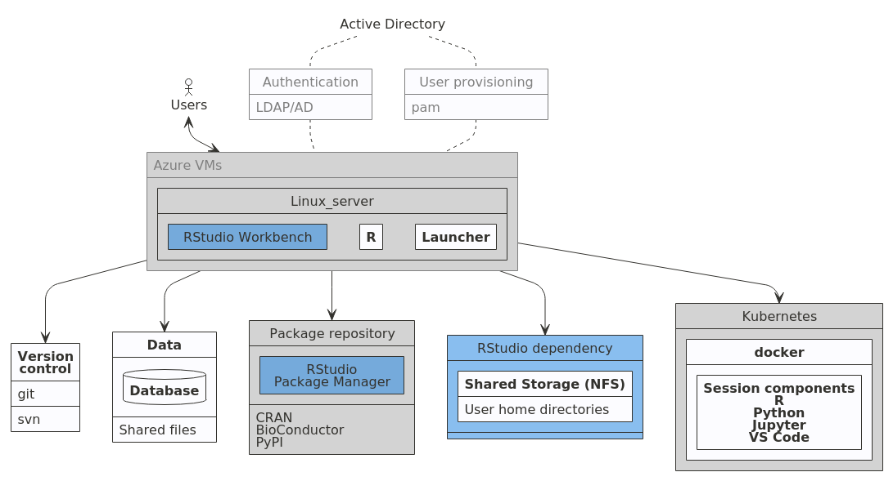

```{r setup, include=FALSE}
knitr::opts_chunk$set(echo = FALSE)
```
# Introduction

While finance is a social science, many parts of modern finance are fundamentally quantitative, with financial researchers solving problems using innovative technological solutions.  Furthermore, the rise of big and alternative data in combination with the exponential growth of AI and financial data science has created new opportunities in the financial sector.  The application is now widespread including areas of risk management[@Lin2017], portfolio construction[@Jaeger2021], investment banking[@IBC2020] and insurance[@SOA2020]. In short the algorithmisation of finance is unstoppable.

While narrow AI, which uses rule-based algorithms, has dominated the fast-paced automation of tasks and process in finance the next wave of automation will be about making judgement calls [@Lopez_de_Prado2018].  Given that finance professionals have an important fiduciary duty towards their clients, the rapid growth on artificial intelligence (AI) in finance has highlighted some important risks around trust, overfitting, lack of interpretability, biased inputs and unethical use of data.  Now more than ever highly computationally digitally literate finance graduates are needed to balance AI and financial machine learning with sustainability, ethics, bias, and privacy to create *trustworthy* data-driven decisions [@Mahdavi2020].

The UK is leading the way in Financial Technology (FinTech) innovation and are forging on with a large scale plan post-Brexit. The recent [Kalifa Review](https://www.gov.uk/government/publications/the-kalifa-review-of-uk-fintech) of UK Fintech
frames fintech as change and sets out an ambitious 5 point plan to foster and scale UK based Fintech firms.  A central part of this plan is to upskill and reskill adults to develop talent by developing training and course from high-quality universities. Now more than ever, it is vital for the economic development of the UK to embed computation as a central tenent of education adults in financial services.

This paper provides an overview of the challenges the finance education curricula faces in remaining relevant in the fast-paced world of financial technology innovations in AI.  We specifically focus on the emerging field of financial machine learning and how to embed computation as a central tenant to allow for a frictionless approach to teaching.  We provide an overview of how this has been achieved in the Management School of Queens University Belfast using a large-scale cloud computing infrastructure and a suite of enterprise-level software solutions to supports a multitude of quantitative business and finance analytics courses.

# Background
## What is financial machine learning?
Machine learning has been adopted at pace in many real world applications, but has been slow to develop in areas of scientific research, especially financial research where traditional econometric techniques dominate.  Leading econometricians argue this is due to a clashing culture [@Athey2019a], where some financial economist argues the ontological differences in econometrics and machine learning are intractable . This naive comparison highlights the epistemological challenges that are faced by computer age statistical inference in a world of rapid algorithmic development [@Efron2016]. Financial machine learning is a sub field of AI in its infancy, which is attempting to reconcile the large differences between econometrics and machine learning.

Machine learning can be defined as a branch of nonparametric statistics mixing, statistical learning, computer science and optimisation [@Molina2019] where algorithms are made up of three fundamental building blocks:

1. A loss function
2. An optimisation criteria
3. A optimisation routine    

Changes in each of these building blocks produces a wide variation of learning algorithms characterising the degree of supervision. 

From an econometric perspective, these models are biased due to their optimisation of a restricted objective according to a specific algorithmic methodology and statistical rationale.  On the other hand, econometrics applies statistics to a data sample, usually in the form of a regression analysis, to examine relationships. Model design uses well-journey economic theory to develop *a prior* hypothesised model. Asymptotic theory is then relied upon to produce objective statistical inference which hopefully minimises bias, possibly at the expensive of increased sample variation.

Financial machine learning attempts to resolve three broad conflicts between machine learning and econometrics[@Lommers2021]:

1. The importance of statistical inference
2. Causality
3. A prior hypotheses and model assumptions

### Statistical inference
Statistical inference is a broad discipline at the intersection of mathematics, empirical science and philosophy. Since its philosophical beginnings through the publication of the Bayes rule in 1763^[Which was used by early advocates to argue the existence of god] computation has been a traditional bottleneck for applied statistical inference framework and has motivated small sample solutions with strong asymptotic principles.  Traditional econometrics retained much of this framework arguable because of the sparsity of data to proxy the realisation of theory.  Up until about the early 1950s computation had been a traditional bottleneck for applied statistics statistical [@Efron2016].  More recently, increases in power and accessibility of computation, has seen machine learning techniques being adopted for statistical inference^[One notable example is the *bootstrap* a computer-intensive inferential engine that is now ubiquitous in applied statistics]

Statistical inference is the bedrock of econometrics, while the main focus of machine learning is prediction. In traditional econometrics, models are build to learn statistical information and uncertainty about the parameters of the underlying data generating process, using an a prior probability model of the data generating process, with a proven track record under strict assumptions. Armed with this theoretical confidence, the econometrician can objectively infer uncertainty and variation characteristics of the theoretical data generating process.  There is a significant faith placed on probability theory for distributional assumptions and model specifications to be amenable to statistical inference. The three most assumed properties in most traditional econometrics models are linearity, additivity and monotonicity. It is argued that the most important assumption, which is rarely cited in textbooks, is *validity* which can be defined as: 

> The data you are analysing should map to the research question you are trying to answer.  This sound obvious but is often overlooked or ignored because it can be inconvenient.  Optimally, this means that the outcome measure should accurately reflect the phenomenon of interest, the model should include all relevant predictors, and the model should generalise to the cases which it will be applied. - [@Gelman2020]   

These generative formulations provide a so-called convenience to statistical significance using p-values [@Lommers2021]. This inherent philospohy of traditional econometric models is argued not to be compatible with out-of-sample inference and prediction [@De_Prado2019].

In contrasts, machine learning models the focus is on prediction output, where the data generated process is generally undefined, with the goal of algorithmically optimisation models to fit the underlying data generating process as well as possible [@Lommers2021]. [@Efron2016] summaries this well in their definition of computer age statistical inference 

<blockquote>
 Very broadly speaking, algorithms are what statistician do while inference says why they do them.  The efflorescence of ambitious algorithms has forced an evolution (though not a revolution) in inference, the theories by which statisticians choose among competing methods. 
</blockquote>

Inference in financial machine learning will rely on economically interpretable feature importance measures, with the emphasis both on in-sample parameter sensitivity analysis and out-of-sample explanations parameter predictive influence.  In recent years, there have been may adjusts in this area, for instances second-generation p-values[@Blume2019; @Zou2021], Shapley values, and bootstrapped neural network parameter p-values [@Dixon2020;@Dixon2020a] 

### Causality

Identifying causal effects with data has a long and varied history, which can be traced back to early statisticians [@Fisher1936] , economists [@Haavelmo1935;@Rubin1974], geneticists [@Sewell1934], and even computer scientists [@Pearl2009]. We can view causal inference as using theory and expert institutional knowledge to estimate the impact of events or decisions on a given outcome of interest [@Cunningham2021]. A naive assumption would be that prediction algorithms in machine learning cannot provide the riguour of econometric empirical design in exacting economic inference. But there is a growing subfield of machine learning which tackles causality in two ways. Firstly, it can improve the predictive power of traditional econometrics by decoupling the search for relevant predictors from the search for specification [@Lopez_de_Prado2018].  Secondly, machine learning can play a key role in the discover of new financial theories beyond the reach of traditional methods, such as a new theory in market microstructure that was used to predict the 2010 flash crash [@Easley2020]

### Hypothesis-driven and the cultural clashes

Over 20 years ago the Berkeley statistician, Leo Breiman, lambasted the statistical community for their dogmatic approaches, in the face of emerging successes of algorithmic approaches to statistical science. He framed his argue and a culture problem where 

>...the statistical community has been committed almost exclusively to data models...where one assumes that the data are generated by a given stochastic data model. [@Breiman2001]

For the most part the statistical community has now accepted Machine learning as a standard part of a statistical science, with graduate level standards incorporating ML techniques alongside the traditional statistical approaches [@Hastie2009;@Efron2016] and leading statisticians exposing their benefits for enhancing scientific discovery [@Spiegelhalter2019].

While the statistics community has move on, the economics and econometrics community has been much slower to depart from stochastic data generating models as consistency, Normality and efficiency. The econometric canon predate the dawn of digital computing, with models devised for estimation by hand. These are legacy technologies that need updating for the digitally savy graduates of the future.  

ML approaches do not naturally deliver these theoretical properties but leading econometricians argue that if econometrics is to remain relevant for students a balance most be struck between *using data to solve problems*^[This is framing econometrics as decision making under uncertainty[@Dreze1972;@Chamberlain2000;Chamberlain2020]]
while perserving the strengths of applied econometrics [@Athey2019a].  Encouragingly, there has been some major advances in theoretical results of the type reported in econometric  [@Athey2017;@Wager2017;Athey2019b;Athey2019c;Wager2019] and applied statistics papers [@Zuo2021;@Apley2020]

The boundary between econometrics and ML is subject to debate[@Lommers2021]. Some methods fall squarely into one or the other camps, but many are used in both. For example, the bootstrap method can be used for statistical inference but also serves as the basis for ensemble methods, such as the Random Forest algorithm. Econometrics requires us to choose a model that incorporates our knowledge of the economic system, and ML requires us to choose a predictive algorithm by relying on its empirical capabilities. Justification for an inference model typically rests on whether we feel it adequately captures the essence of the system. The choice of pattern-learning algorithms often depends on measures of past performance in similar scenarios. Inference and ML are complementary in pointing us to economically meaningful conclusions.

## Brief history on computation in finance and the cloud

Finance and computation has gone hand in hand for centuries, with quantitative finance taking its roots from Bachelier’s *Theory of Speculation* [@Bachelier1900]. Computation as a utility can be traced back to Professor John McCarthy in the early 1960s.  A computering power has become more accessible and affordable computation has become a more central tennent to the finance industry.  Figure 1 provides a brief timeline of some of the key moments in the the development of computing in finance and the cloud.

On the *buy-side* portfolio management was transformed with the quantitative research of Harry Markowitz in the early 1950’s. Markowitz showed how a complex mean-variance portfolio optimisation problem could be approximated using algorithmic programming. Meanwhile, in the early 1960's [Ed Thorp](https://en.wikipedia.org/wiki/Edward_O._Thorp) and [John Simons](https://en.wikipedia.org/wiki/Jim_Simons_(mathematician)), using computer-aided statistical algorithms, showed how arbitrage opportunities, unseen by traditional hedge fund managers, could be exploited to consistently *beat the market*.  

On the *sell-side* a game changing breakthrough in the 1970s was a model to price derivative products [@Black1973;@Merton1973] (BSM model), resulting in explosive growth of options markets [@Cesa2017]. Subsequently weaknesses in the BSM model fuelled a growth in financial computing. Quantitative researchers, with the increased available of computational power, used more realistic continuous-time pricing models to estimate complex partial differential equations [@Reisinger2018].

```{r timeline, fig.cap="Computing landmarks finance and cloud computing"}
library(vistime)
library(ggrepel)
library(ggdark)
library(stringr)

c("Harry Markowitz <br> introduces <br> Critical Line Algorithm",
  "NASDAQ launched <br> as first electronic <br> communications market",
  "Fischer Black <br> proposes idea of fully <br> electronic exchanges <br> in a landmark paper",
  "Black-Scholes-Merton <br> model for derivative pricing",
  "Jim Simons <br> Founded Renaissance Technologies (RenTec), <br> introducing complex mathematical trading algorithms to markets",
  "Michael Bloomberg <br> launches Innovative Market Systems <br> (which become Bloomberg LLP)",
  "RenTec's Medallion fund <br> launched, <br> later to become <br> the most successful hedge fund in history",
  "Heston & Dupire <br> introduce stochastic volatility models",
  "Jump diffusion <br> models introduced",
  "SEC<br>order US stock<br>exchanges to be decimalised",
  "Flash Crash <br> (Markets drop 10% in a matter of minutes)",
  "Basel III <br> requires to periodical estimate <br> counterparty risk of complex derivatives",
  "Quantum computing <br> is proposed by Renbart et. al <br> for derivative pricing",
  "RenTex's Medallion <br> Fund average 66% annual return <br> over last 30 years",
  "CME Smart Stream <br> launched offering real-time <br> cloud-based market data")->financeMs
  

c("Professor JohnMcCarthy (MIT) <br> suggested computing will be sold as a utility",
  "IBM <br> virtualised operating systems",
  "ARPANET <br> launched by US Advanced <br> Research Project Agency <br> connect 4 university computer systems",
  "100,000 <br> computers on Internet",
  "World Wide Web <br> lanuched with 1 million computers on Net",
  "Cloud Computing <br> as a concept <br> introduced in Compaq report",
  "Amazon (AWS) <br> launched as first public cloud service",
  "Big Data <br> as a concept <br> introduced by the <br>OpenNebula research project launched",
  "Elastic Computing (EC2) <br> launched by Amazon",
  "Dropbox <br> launch cloud storage",
  "Microsoft <br> launch Azure cloud computing",
  "DigitalOcean <br> Droplets launched",
  "Real-time <br> streaming data on AWS",
  "Machine learning <br> sold as a service in the Cloud",
  "Massive data-center <br> under the Altantic ocean <br> launched by Microsoft",
  "Google TPU's <br> (Tensor Processing Units) <br> avaliable on the cloud, <br> introducing tensor-based mathematical to public")->cloudMs            
content<-c(financeMs,cloudMs)            
start   = paste0(c("1952","1971","1972","1973","1982","1983","1988","1993","2000","2001","2010","2013","2017","2018","2019",
                   "1961","1967","1969","1988","1991","1996","2002","2005","2006","2007","2010","2012","2013","2015","2018","2019"),"-01-01")

i<-length(financeMs)
j=length(cloudMs)

timeline_data<-data.frame(
  event =str_wrap(content,width=5),
  start=start,
  end=start,
  group=c(rep("Finance",i),rep("Cloud <br> computing",j)),
  fontcolor=c(rep("",i),rep("blue",j)))

p<-hc_vistime(timeline_data,col.color = "fontcolor",)
library(highcharter)

thm <- hc_theme(
  colors = c("red", "green", "blue"),
  chart = list(
    backgroundColor = "lightgray"),
  title = list(
    style = list(
      color = "#333333",
      fontFamily = "Shadows Into Light",
      fontSize=25)),
  subtitle = list(
    style = list(
      color = "#666666",
      fontFamily = "Shadows Into Light")),
  legend = list(
    itemStyle = list(
      fontFamily = "Tangerine",
      color = "black"),
    itemHoverStyle = list(
      color = "gray"
    )
  )
)

p %>%
  hc_add_theme(thm)
```

^[[@Varghese2019] provides the source of the cloud computing timeline, while the timeline for computational finance events is the authors own calculations]


# Teaching enviroment for computing
To understand more about the computational foundations for students we borrow from the extant statistical education literature [@Kaplan2007; @Cetinkaya-Rundel2018].  Much like teaching statistics and data science applied finance has two interconnected goals:
1. Get students to do something interesting with data (and code) within the first ten minutes of the first class.
2. Get students to think about computation as an integral part of the quantitative finance curriculum.

An common solution is to use computing labs to facilitate computation exercises.  The downside is that instructors usually do not have administrative access and therefore struggle accomplish even the basic maintenance tasks.  Furthermore, this usually leads to common environment for all courses, rather than specialised set-ups for more enhanced student computational needs.  Finally, to achieve the second goal requires active engagement of computation for all contact time. 

We use a web browser-based solutions, RStudio’s Teams, to provide a frictionless student experience in both lectures and lab sessions. The Workbench product (formerly RStudio server pro) is professional web server software, where facilitates interoperable computation integrating R and Python leveraging support for Jupyter, VSCode, and RStudio integrated development environments (IDEs) [@RStudioW2021].

## Why R and Python?
R and Python are the two leading languages used in industry for data analysis. Thus, to best prepare students to be competitive and perform on the job market, we made the explicit decision to teach both languages on the MSc quantitative finance.  These languages are also infiltrating academia, although there are some notable holdouts where econometrics is taught using commercial graphical user interfaces(GUI).  Proponents of GUI-based econometrics teaching argue that teaching statistical concepts is less intimidating to beginners when using a point-and-click approach compared to command line methods. In argument goes that with the latter teaching programming and statistics in tandem creates too much friction for students.

In our experience such convenience is only possible by removing data analysis from the course content and providing students with tidy, rectangular data.  But for modern financial data analytics this approach is a disservice to students.  Furthermore, point-and-click approaches requires a bespoke student user manual that can run to [40-plus pages](https://github.com/barryquinn1/FMLmaterial/blob/27d8094fee39fa0284d3a0bfc10e38dcd3bebcac/Introducing%20Stata.pdf). We argue this is a considerable learning curve for the novice student which isn’t generalisable to other analytics workflows.  In general, using GUI *copy and paste* workflow can actually increase student frictions, is more error prone, and harder to debug , and most importantly disconnects the logical link between computing from financial analytics[@Baumer2014].  

<!-- ### Teaching statistics by simulation -->
<!-- A meaningful understand of econometrics requires more than reading and regurgitating textbook material.  The false discovery crisis in finance suggests that applying out-of-the-box econometric models to observational data also fails to provide a deep understanding of the chasm between econometric model abstractions and the impermanence of the statistical features of financial data [@De_Prado2019].   -->

## Why RStudio Teams?

Figure 1 visualises the components that make up the RStudio Team bundle. 

```{r rstudioteams, fig.cap="The three components of the RStudio Enterprise Team Bundle",fig.pos="center"}
knitr::include_graphics('img/Team.png')
```


RStudio describe this product as follows: 

>RStudio Team is a bundle of RStudio’s enterprise-grade professional software for scaling data science analytic work across your team, sharing data science results with your key stakeholders, and managing R and Python packages. RStudio Team includes RStudio Workbench, RStudio Package Manager, and RStudio Connect.
RStudio Team offers convenience, simplicity, and savings to organizations using R, Python and RStudio at scale. 

- [@RStudioT2021]

Teams is a enterprise-grade set-up offered free of charge for academic teaching.  For academic budgets, this is a significant saving, typically between \$15,000 to \$20,000.  The School’s budget can then focus on purchasing an agile computing infrastructure.  

For teaching computation, the IDE is the most important tool in this bundle. The Workbench product comes with Jupyter (notebook and lab) and RStudio native IDE which provide a powerful interface which helps to flatten the learning curve in command line teaching. It has a series of panes to view data, files, and plots interactively. Additionally, since it is a full fledged IDE, it also features integrated help, syntax highlighting, and context-aware tab completion.

Students access the RStudio IDE through a centralised RStudio server instance, which allows us to provide students with uniform computing environments. Additionally, RStudio’s direct integration with other critically important tools for teaching computing best practices and reproducible research, some of which we discuss in Sections 3.1 and 3.2, also influenced our decision for making it central in our toolkit. 

Importantly, we do not dissuade students from create a local instances of R and Python, our experience suggests we do not want it to be a prerequisite of any module. Students are then allowed to develop their own personal setup progressively in the knowledge that full-fledged instance is always available for them as a departmental resource.


## Remote RStudio Workbench Platform

A popular approach to running RStudio server in teaching computation in higher level statistics courses is to build a shared infrastructure with high powered computation power.  This hardware is usually housed securely on-premises and managed by a dedicated IT team.  For example, Duke University statistics department purchase and managed a powerful farm of computer servers which can service approximately 100 students per semester [@Cetinkaya-Rundel2018].  We have chosen run RStudio Workbench using virtualised hardware in the cloud via Microsoft Azure.  Figure 3 shows the architecture of the current set-up.  Student users are set up with a Linux account, authenticated using a departmental login.  Students then connect to a single RStudio Workbench instance and via the Launcher software can open an IDE to access Python or R scripting environments.  Each student experiences a similar computing environment solving the perennial
[**but it worked on my machine?**](https://www.kevinwanke.com/why-you-should-never-use-the-phrase-but-it-works-on-my-machine/) problem.

The primary advantage of running and managing a cloud computing platform is control.  Lecturers control a common user environment for each course, including required packages, resource configuration, remove or kill sessions and monitor the over resource demand on the system. This management work adds a considerable burden to the lecturer and the IT support, but our experience, and student feedback, suggests that the benefits far outweigh these additional costs.  Furthermore, not providing students with such a resource is a disservice to their employability in the modern world of modern finance.    

```{r current-setup, fig.cap="Current set up of RStudio workbench on Azure",fig.align="center"}
knitr::include_graphics("img/rstudiowb.png")
```


## Containerisation in Finance


Linux containers are technologies that allow you to package and isolate applications with their entire runtime environment [@banker2017].  Their strategic advantage is their application independence from the underlying operating environment enabling standardisation and automation which can significantly lower cost and operational risk.  

Virtualisation technology is the underlying element of cloud computing and containers take this to the next level. Cloud computing has traditionally usied virtual machines to distribute available resources and provide isolated environments among users. The key difference between virtual machines and containers, is that containers share the same underlying operating system [@Mavridis2019]

Containerisation as a concept has been around for decades, but the emergence of the open source [Docker Engine](https://www.ibm.com/cloud/learn/docker) has accelerated the adopt of this technology. They are a *lightweight* virtualisation technology to allow the sharing of one operating system in such a way that all code, runtimes, tools and libraries need for a piece of software are made available. This *build once run anywhere* property makes them highly portable, agile and efficiency approach to running sandboxed instances of RStudio Workbench.  The open source nature of Docker makes it a transparent and powerful tool for reproducible computational finance research. From a teaching perspective, each student can be mapped to an single container, secluding individual operates and maintaining strict control of computing resource usages to provide accidental disruption of individual student's work.

Furthermore, using a container orchestration system such as [Kubernetes](https://www.ibm.com/cloud/learn/kubernetes), a cluster can be deployed and the operational overhead can be largely automated using [AKS](https://docs.microsoft.com/en-us/azure/aks/intro-kubernetes).  Given they are much lighter weight than VMs a large container farm of RStudio instances can be run concurrently on one single server.  We plan to build this infrastructure into our platform and have sketched out the planned setup in figure 4.

```{r future-setup, fig.cap="Dockerised set up of RStudio workbench on Azure",fig.align="center"}

```

One big challenge with Kubernetes is that is has a steep learning curve and even though Azure offer a automating management service, an administrator will still be need to manage individual instance house-keeping.  For this reason we opted for a more straight-forward approach which is being using in Duke University's statistical department and was created by Mark McCahill. He kindly shared his set up (https://gitlab.oit.duke.edu/mccahill/docker-rstudio) which we use to create a strict sandboxed virtual enviroment for each student.

# Course implementation

The above was piloted for masters level teaching in 2020-2021 academic year at Queen's Management School.  Named Q-RaP (Queen's management school Remote analytics Platform) has been deployed in 2 masters level course, algorithmic trading and investment, and time series financial econometrics.

## Reproducibility with computational notebooks

Computational notebooks are documents which combine code chunks with text to produce an dynamic report which is easy to reproduce and adapt. The allow the user to follow the PPDAC (Problem, Plan, Data, Analysis, Communication) for credible analysis and report that is a professional standard in the statistics world [@Spiegelhalter2019]. Unlike the copy and paste approach all five parts of the PPDAC approach can be included in one document, providing an enhanced level of transparency, portability and reproducibility.

There are two main systems for producing computational notebooks in our infrastructure; Jupyter notebooks (and Jupyterlabs) and RMarkdown. Both are based on the Markdown, one of the most popular markup languages in computing. Using Markdown is different than using a WYSIWYG editor. In an application like Microsoft Word, you click buttons to format words and phrases, and the changes are visible immediately. Markdown isn’t like that. When you create a Markdown-formatted file, you add Markdown syntax to the text to indicate which words and phrases should look different. Markdown can be used for pretty much everything, from websites to technical documents.  It is portable, platform independent, future proof, and an important tool for the modern financial data scientists. 

While Jupyter notebooks are primarliy associated with python scripting, they can also easily include R scripting if a R kernel engine is installed. They are a lightweight, low learning curve approach to teaching computing and are an excellent way to get non-technical students up and running in the first 10 minutes of a course. RMarkdown are probably one of the most powerful tools in the RStudio IDE.  They can combine text with a vast array for language chunks include Bash, SQL, Stan, and many more. When teaching computing in finance we mainly use Python and R chunks, the former output in the RStudio enviroment using the `reticulate` package.

## Version control, git and GitHub

Table 1 summarises some some of the tools used and the future courses that will be exploiting the platform in academic year 2021/2022.

```{r usage table}

```

